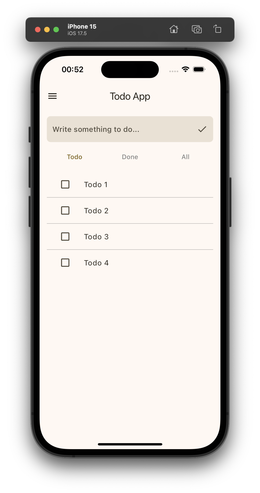
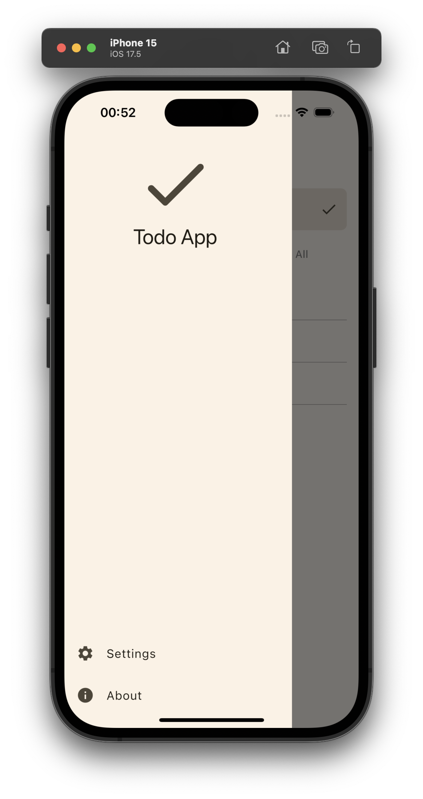
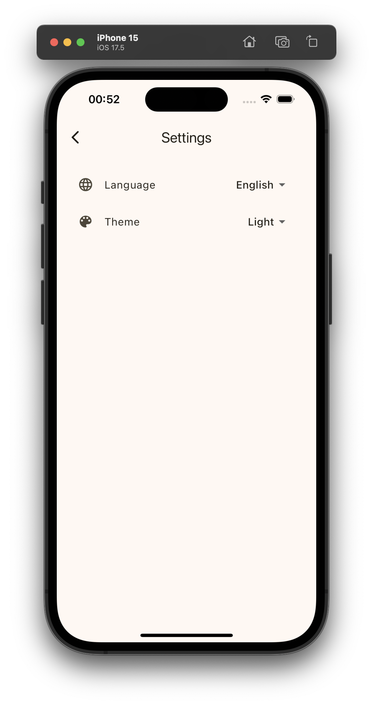
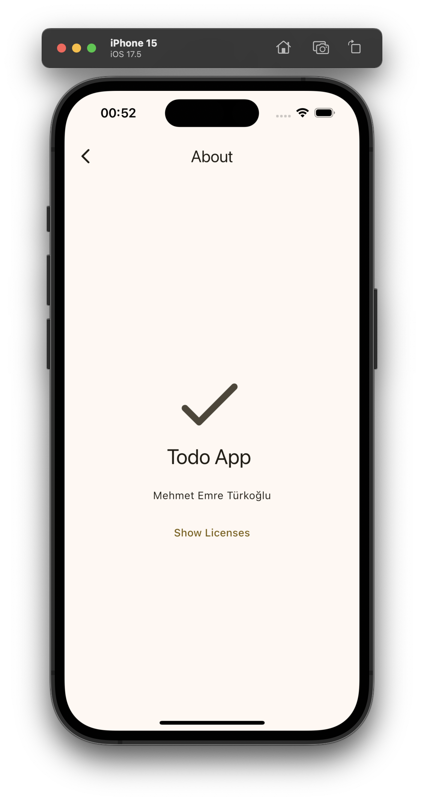
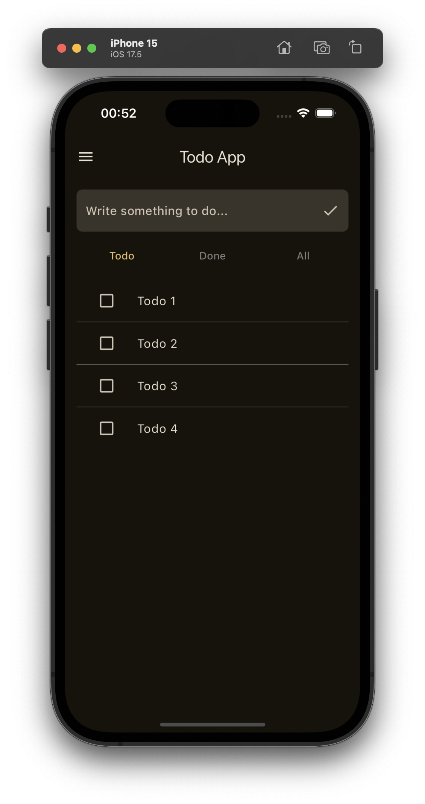
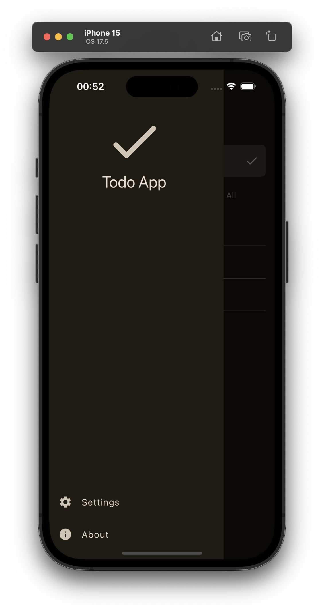
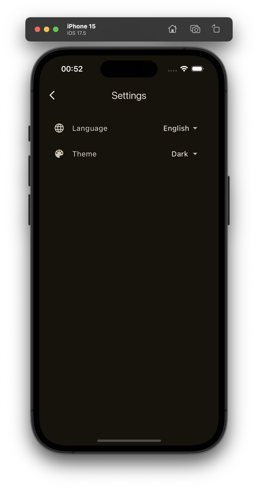
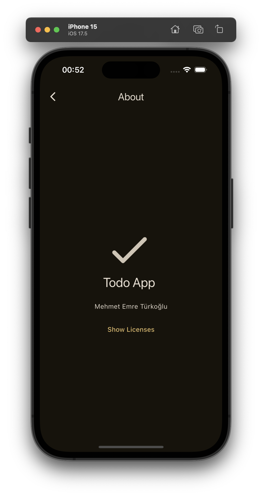

# Flutter Todo App with Riverpod and MVVM


## Overview

This project is a simple yet robust Todo application built using Flutter. The app follows the Model-View-ViewModel (MVVM) architectural pattern and leverages Riverpod for state management. The goal of this project is to demonstrate a clean and scalable architecture for Flutter apps.

### Light Appearance

|  |  |  |  |
|:-----------------------------------------------:|:----------------------------------------------:|:----------------------------------------:|:----------------------------------:|

### Dark Appearance

|  |  |  |  |
|:-----------------------------------------------:|:----------------------------------------------:|:----------------------------------------:|:----------------------------------:|

## Features

- **Add, Update, and Delete Todos:** Basic CRUD operations for managing your tasks.
- **Task Completion Tracking:** Mark tasks as completed or incomplete.
- **Persisted Data:** All tasks are stored locally, ensuring persistence across app sessions.
- **State Management:** Riverpod is used to manage app state in a scalable way.
- **MVVM Architecture:** Separation of concerns through MVVM makes the codebase easier to manage, test, and extend.
- **Responsive UI:** Fully responsive UI that works well on both mobile and tablet devices.
  
## Getting Started

### Prerequisites

- [Flutter SDK](https://flutter.dev/docs/get-started/install)
- A code editor like [VS Code](https://code.visualstudio.com/) or [Android Studio](https://developer.android.com/studio)

### Installation

1. **Clone the repository:**
   ```sh
   git clone https://github.com/memmre/Todo.git
   cd todo
   ```

2. **Install dependencies:**
   ```sh
   flutter pub get
   ```

3. **Run the app:**
   ```sh
   flutter run
   ```

## Contributing

Contributions are welcome! If you'd like to contribute, please fork the repository and use a feature branch. Pull requests are warmly welcome.

1. Fork the repo
2. Create your feature branch (`git checkout -b feature/AmazingFeature`)
3. Commit your changes (`git commit -m 'Add some AmazingFeature'`)
4. Push to the branch (`git push origin feature/AmazingFeature`)
5. Open a Pull Request

## License

This project is licensed under the GPL 3.0 License. See the [LICENSE](licenses/gpl-3.0.txt) file for details.
